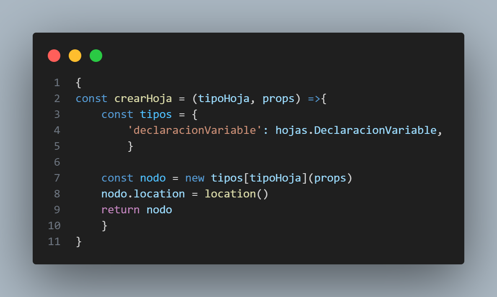
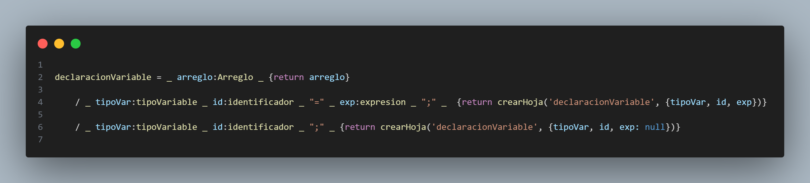
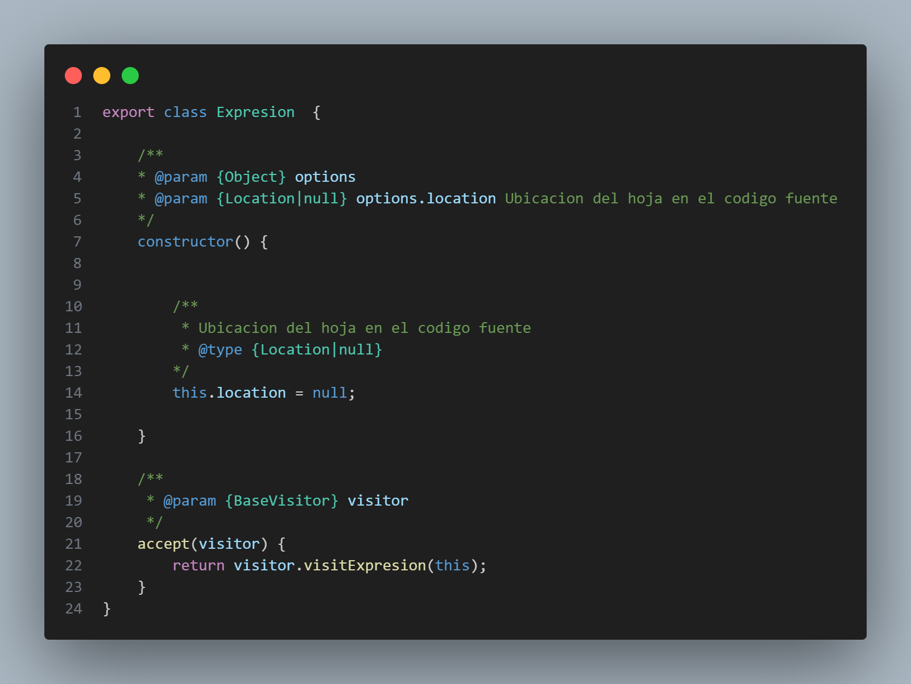
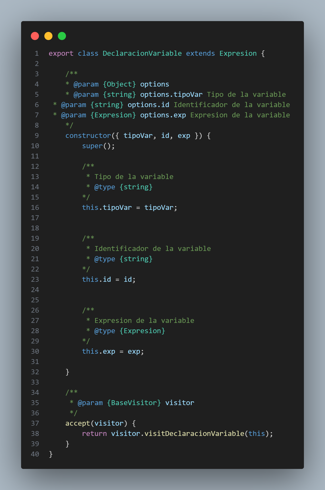
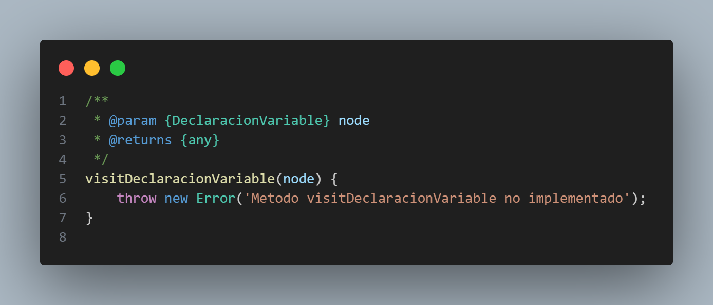
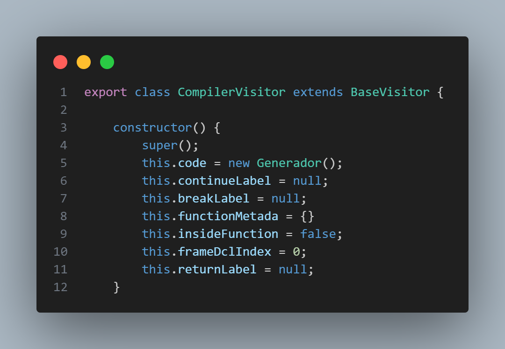
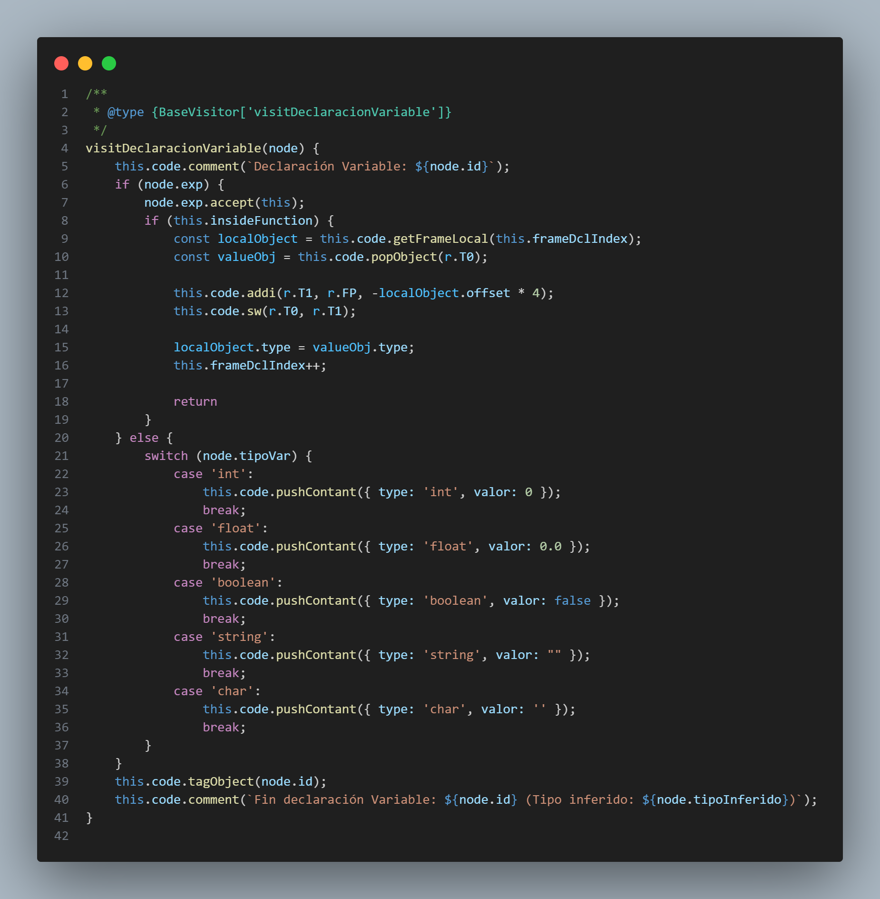

# Organización de Lenguajes y Compiladores 2 -N-
## Proyecto 2
### Segundo Semestre 2024
```js
Universidad San Carlos de Guatemala
Programador: Pablo Andres Rodriguez Lima
Carne: 202201947
Correo: pabloa10rodriguez@gmail.com
```
---
## Descripción del Proyecto
El compilador para el lenguaje de programación OakLand ha sido desarrollado. Este lenguaje, inspirado en la sintaxis de Java, se destaca por su capacidad para manejar múltiples paradigmas de programación, incluyendo la orientación a objetos, la programación funcional y la procedimental. Se ha implementado también una plataforma sencilla pero robusta, que permite crear, abrir, editar y compilar código escrito en OakLand de manera eficiente.

Informacion sobre codigo de OakLand:

### Frontend
- Desarrollado en html, css y js.
- Patron de diseño: Observer
    Observer: Se utiliza para notificar a los observadores (componentes de la interfaz grafica) cuando se realice una accion en el editor de texto.
- Desplegado en: https://pablor03.github.io/OLC2_Proyecto2_202201947/frontend/ 

### Backend
- Desarrollado en Js con herramienta para analisis de gramatica independiente del contexto (Pegjs).
- Patron de diseño: Visitor
    Visitor: Se utiliza para recorrer el arbol de analisis sintactico y realizar las acciones correspondientes a cada nodo.

---


# Explicación de la estructura del proyecto

## Frontend 
El frontend del proyecto se encuentra en la carpeta frontend, en la cual se encuentran los archivos html, css y js que conforman la interfaz grafica del proyecto.

#### [index.html](https://github.com/PabloR03/OLC2_Proyecto2_202201947/blob/main/frontend/index.html) 
Archivo html que contiene la estructura de la pagina web, en el se importan los archivos css y js necesarios para el funcionamiento de la pagina.

#### [index.css](https://github.com/PabloR03/OLC2_Proyecto2_202201947/blob/main/frontend/index.css)
Archivo css que contiene los estilos de la pagina web.

#### [index.js](https://github.com/PabloR03/OLC2_Proyecto2_202201947/blob/main/frontend/index.js) 

Archivo js que contiene la logica de la pagina web, en el se realizan las peticiones al backend y se actualiza la interfaz grafica.

---
(Para hacer mas explicito el codigo se explicara como se implemento el patron visitor para la declaracion de variables, mostrando todos los objetos necesarios para su implementacion, ya que es repetitivo se usaria  el mismo procedimiento para las demas instrucciones)
## Backend

El backend del proyecto se encuentra en la carpeta backend, en la cual se encuentran los archivos necesarios para el analisis del codigo escrito en OakLand.

### [Analizador.pegjs](https://github.com/PabloR03/OLC2_Proyecto1_202201947/blob/main/backend/Analizador.pegjs)

Archivo que contiene la gramatica del lenguaje OakLand, en el se definen las reglas de produccion del lenguaje.

Antes de explicar la gramatica se explicara el patron de diseño visitor.
Se implemento el patron de diseño visitor para recorrer el arbol de analisis sintactico y realizar las acciones correspondientes a cada nodo.


Ejemplo de gramatica desarrollada en pegjs:


Esta herramienta necesita de un comando en consola para generar el archivo js que contiene la gramatica en codigo js.


```bash
pegjs Analizador.pegjs

```
### [Hojas.js](https://github.com/PabloR03/OLC2_Proyecto2_202201947/blob/main/backend/Hojas/Hojas.js)
Archivo que contiene las clases que representan las hojas del arbol de analisis sintactico.
constructor: Se encarga de inicializar los atributos de la clase.



Implementacion de la clase Hojas para la declaracion de variables:


### [Visitor.js](https://github.com/PabloR03/OLC2_Proyecto2_202201947/blob/main/backend/Patron/Visitor.js)
Archivo que contiene la clase visitor que se encarga de recorrer el arbol de analisis sintactico y realizar las acciones correspondientes a cada nodo.

llamada al metodo visitar de la clase visitor:
Este se encarga de acceder a la clase correspondiente a la hoja y realizar la accion correspondiente.



### [Compilador.js](https://github.com/PabloR03/OLC2_Proyecto1_202201947/blob/main/backend/Compilador.js)
Archivo que contiene la clase Compilador que se encarga de interpretar el codigo escrito en OakLand.
Constructor: Se encarga de inicializar los atributos de la clase.


Uso de Nodo para la declaracion de variables:



1. Declaración y asignación:
Objeto Nodo: Se crea un objeto de la clase Nodo, el cual contiene tres elementos clave: el nombre de la variable (node.id), el valor a asignar (si se proporciona, node.exp) y el tipo de la variable (como int, float, etc.).
Llamada al método visitar: El método visitDeclaracionVariable de la clase Visitor es llamado, lo que permite procesar el nodo actual (la declaración de la variable) de manera personalizada.
Acciones en la hoja: Dependiendo del tipo de nodo, se accede a la acción correspondiente dentro del árbol de ejecución, lo que determina qué se hace con el valor de la variable.
2. Validaciones y asignaciones:
Si la variable tiene un valor asignado (node.exp):
Se evalúa la expresión (node.exp.accept(this)), procesando cualquier operación o valor asociado antes de la asignación.
Si estamos dentro de una función (this.insideFunction):
Se obtiene el valor local del marco de pila (this.code.getFrameLocal).
El valor calculado se guarda en el registro T0, y luego se almacena en la dirección de la pila que corresponde a la variable local.
Se actualiza el tipo de la variable con el tipo del objeto (valueObj.type) que se obtuvo.
Se incrementa el índice de la declaración (this.frameDclIndex++) para procesar la siguiente variable.
Si no se proporciona un valor inicial:
Se establece un valor por defecto dependiendo del tipo de variable (node.tipoVar). Se utiliza un switch para asignar un valor inicial:
int → valor inicial 0.
float → valor inicial 0.0.
boolean → valor inicial false.
string → cadena vacía "".
char → carácter vacío ''.
Este valor se introduce en la pila utilizando el método pushContant, que asocia un tipo y un valor inicial.
3. Manejo de la tabla de símbolos:
Etiquetado y comentarios: Una vez que se ha asignado o declarado la variable, se etiqueta el objeto (this.code.tagObject(node.id)), permitiendo que sea referenciada posteriormente.
Se agrega un comentario (this.code.comment) que indica el inicio y el fin de la declaración de la variable, mencionando el tipo inferido en el proceso (node.tipoInferido).
Puntos a considerar:
Validación en tabla de símbolos: Antes de agregar una nueva variable, el sistema verifica si ya existe en la tabla de símbolos. Si la variable ya está presente, se actualiza su valor; de lo contrario, se agrega como una nueva entrada.
Validación de tipo: Se valida que el valor asignado coincida con el tipo de la variable. Si no corresponde, el valor se guarda como null o el valor por defecto del tipo.


---

